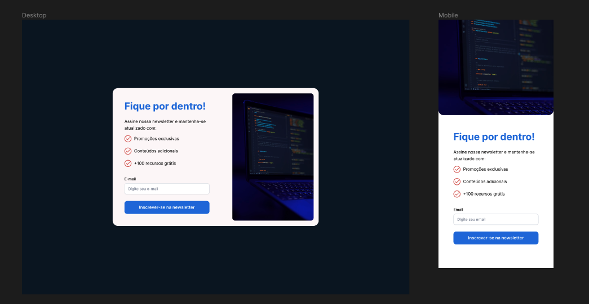

# :email: Newsletter Email Card

## :rocket: Objetvo
Desenvolver um card de email responsivo para newsletter.

## :wrench: Tecnologias
- Vue.js
- Typescript
- CSS

## :art: Layout

[Layout - Figma](https://www.figma.com/file/K2wuDahkMEx0LSkYAYf3Yb/Newsletter?type=design&node-id=1%3A3&mode=design&t=kYPjtTfNTBPo6vlP-1)



## :red_circle: Instruções
1. Clone o repositório
2. Crie uma branch para sua solução
3. Ao abrir o projeto, digite: ``` npm install ``` no terminal 
4. Digite ```npm run dev``` para rodar o projeto localmente
5. O projeto já conta com um componente de exemplo já implementado.

## :pushpin: Requisitos
- :art: [Figma](https://www.figma.com/downloads/)
- :balloon: [Node.js](https://nodejs.org/en/download)

## :paperclip: Recursos Úteis
- [Figma 101 para desenvolvedores](https://www.figma.com/file/tfRKgwf3CdQkwiO44SlNrK/Figma-101-for-developers-(Community)?type=design&node-id=8%3A135&mode=design&t=7EaL43iCw5piftIh-1)
- [Vue Docs](https://vuejs.org/guide/introduction.html)
- [Documentação - Estilizando um componente em Vue](https://vuejs.org/api/sfc-css-features.html)
- [Documentação - Registrando componentes em Vue](https://vuejs.org/guide/components/registration.html#local-registration)
